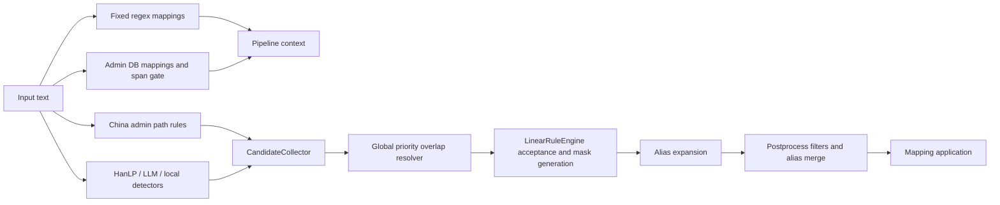

# Recognition Rule-System Retrospective

> **Status**: decision record · no code changes in this review  
> **Date**: `2026-07-13`  
> **Decision**: targeted architectural replacement — retain deterministic detectors and existing public pipeline entrypoints, replace the candidate-to-mapping decision path incrementally.

> **2026-07-26 implementation note**: The flow below is historical evidence for the replacement decision. Runtime discovery now requires successful full-document registration, retains fixed structured identifiers and SQLite administrative divisions, routes supported candidates through `CandidateCollector`, and fails closed instead of invoking title/party/fallback-person/local-organization/HanLP or suffix-grammar discovery.

## Decision

The current system should **not** continue through one-off regex, prefix, suffix, blacklist, or postprocess additions. This is not primarily a detector-recall problem. It is a missing decision model between a raw span match and a redaction mapping.


### 2026-07-14 sample-loop update

The latest 13-entry library is a **feedback queue**, not a gold corpus: every row names the same unavailable source document and carries only final mapping text plus a terse reason. Ten rows are organization deletions; three adjust organization masks. The three structurally provable false positives are document/project-shaped strings (`01补鉴定意见书`, `冀光大价鉴字`, `41#地项目`). They now fail the common LLM entity validation path before candidate materialization; no runtime sample lookup or document-specific blacklist was added.

The remaining "切字多了" rows cannot safely be turned into negative rules: full registered organization surfaces and aliases may be valid entities, while the stored row omits original context, candidate span, source, and the intended corrected span. The source `.docx` was not present in the workspace or standard local document locations, so exact replay was impossible. Preserve these as diagnosis debt and add provenance fields before considering further rule changes.
Retain the public `RedactionPipeline.redact(...)` interface and deterministic data sources (identity/contact patterns, administrative databases, structured party fields). Replace the internal decision path with a deep `EntityResolutionModule` that produces typed span decisions, canonical entities, and independently computed redaction actions. This is a targeted restructure, not a big-bang rewrite.

## Observed Current Flow



- `pipeline.py::_linear_collect_regex_with_fixed` creates `MappingEntry` values before candidate resolution.
- `pipeline.py::_linear_collect_admin_spans` accepts administrative candidates and creates mappings before general candidates are collected; `admin_spans` later suppresses overlaps.
- `CandidateCollector.collect` gathers title, party, fallback-person, China-rule, organization, and LLM candidates, but only after those early mappings/spans exist.
- `resolve_candidate_overlaps` picks one candidate using a global source/type/confidence/length tuple in `candidate_resolution.py`.
- `LinearRuleEngine.discover` combines review verdicts, span resolution, policy check, identity inference, and rendering state while iterating in document order.
- `apply_postprocess` removes or merges mappings after they have been accepted.

## Measured Evidence

Offline rule-path probes exposed two architecture defects.

| Probe | Candidate/overlap result | Final result | Interpretation |
|---|---|---|---|
| `中国农业银行股份有限公司石家庄广安支行…医院…` | The collector resolved two correct organization spans. | The final map still contained only early `hebei_admin_db` mapping `石家庄`. | Pre-accepted administrative mappings bypass the normal span resolver; later valid organizations cannot supersede them. |
| `临时用水水源提供至施工场区，按照同期贷款市…` | `china_admin_rules` emitted both arbitrary suffix-bearing strings as locations. | The engine generated four location mappings, including suffix-stripped aliases. | Rule-path grammar treats arbitrary prose plus `区/市` as an administrative path; no gazetteer/semantic evidence is mandatory. |
| `发包人要求总包单位提交合同协议书。` | No entity candidate. | No mapping. | Generic-role rejection works here, but only via scattered reject tables rather than an explicit role/entity distinction. |
| Explicit full name + `以下简称…公司` | Full organization span accepted, then alias mapping generated. | Full and explicit alias mapping produced. | The desired entity-link behavior exists, but is mixed with heuristic alias derivation and postprocess merges. |

## Findings

### High risk

1. **Multiple paths create final mappings before a single span decision exists.**
   - Evidence: `pipeline.py::_linear_collect_regex_with_fixed` and `_linear_collect_admin_spans` append directly to `ctx.mappings`; `CandidateCollector.collect` and `LinearRuleEngine.discover` only govern later candidates.
   - Impact: no global invariant can guarantee that a complete institution wins over an embedded location, or that one occurrence is evaluated once.
   - Required change: all non-fixed entities must enter one `SpanProposal` collection; mappings may only be created after resolution.

2. **Administrative “rule” recognizer is a suffix grammar, not an authoritative administrative recognizer.**
   - Evidence: `china_admin_rules.py::ADMIN_PATH_SEARCH_RE` accepts 2–12 arbitrary Han characters followed by an administrative suffix; `detect_china_admin_rule_candidates` accepts decomposition once a province is present or a fragment can be decomposed; `_split_county_suffix` accepts arbitrary `…区/县/旗/市`.
   - Impact: ordinary legal prose becomes a location. Adding more `FALSE_LOCATION_TERMS` is an endless blacklist cycle.
   - Required change: administrative name acceptance must require a database/gazetteer-backed hierarchy match. Regex can locate a possible span but cannot establish `LOCATION` truth by suffix alone.

3. **Span classification, entity identity, policy eligibility, and mask rendering are coupled.**
   - Evidence: `linear_engine.py::accept_location`, `accept_person`, and `accept_organization` both validate candidates and mutate mappings/counters/known-entity state. `accept_organization` simultaneously chooses institution behavior, legal-form parsing, alias identity, location reuse, and mask surface.
   - Impact: an adjustment to formatting or policy alters recognition results; testing a classification rule requires asserting a rendered mask.
   - Required change: enforce `proposal → span decision → entity link → policy action → renderer` as separate deterministic phases.

4. **Postprocess is correcting earlier classification rather than only rendering-safe normalization.**
   - Evidence: `postprocess.py::_filter_locations_inside_organizations`, `_filter_fragments_inside_longer_entities`, `_filter_org_alias_prefixed_locations`, and `_merge_organization_alias_mappings` remove or re-identify mappings after acceptance.
   - Impact: rule behavior is order-dependent and difficult to explain. A new postprocessor can silently undo an otherwise valid candidate.
   - Required change: move exclusion and identity resolution before policy/rendering; retain postprocessing only for output ordering, duplicate exact spans, and replacement safety.

### Medium risk

5. **Global source priority is an insufficient conflict model.**
   - Evidence: `candidate_resolution.py::SOURCE_PRIORITY`, `TYPE_PRIORITY`, `_candidate_quality`, and `resolve_candidate_overlaps` resolve all overlap types with one rank tuple.
   - Impact: a high-ranked source can beat a more semantically complete nested span regardless of relation. Span containment is not equivalent to mutual exclusion: organization contains place; address contains location; role includes a person.
   - Required change: resolve by relation class — `contains`, `same_span`, `crosses`, `adjacent` — with type-pair policy, not a global priority number.

6. **The same semantic validity checks are scattered and drift-prone.**
   - Evidence: organization/noise decisions occur in `filters.py`, `detectors.py`, `candidate_resolution.py`, `candidate_collector.py`, `linear_engine.py`, `postprocess.py`, and `llm.py`; source-specific prefix/suffix checks are duplicated.
   - Impact: a new correction may be rejected in one path but accepted in another. This drives string-specific patches.
   - Required change: one classifier registry per entity type returning positive/negative evidence and explicit rejection reasons.

7. **Canonical identity is inferred from string similarity after mapping creation.**
   - Evidence: `linear_engine.py` maintains `known_organizations` and derived alias cores; `postprocess.py::_merge_organization_alias_mappings` later unions profile similarity.
   - Impact: unrelated companies can merge on a short shared surface; late merge makes the wrong association hard to audit.
   - Required change: canonical linking needs evidence labels: `EXACT_FULL_NAME`, `EXPLICIT_ALIAS`, `SOURCE_DECLARED_VARIANT`; heuristic similarity may only produce `REVIEW`, never automatic identity union.

8. **Evaluation measures rendered mapping equality but not decision quality.**
   - Evidence: `evaluation.py::_match_entities` matches `type/original/masked`; `regression.py` projects aggregate precision/recall/F1 but has no span-boundary, false-relation, provenance, or decision-reason metrics.
   - Impact: a correct entity can appear as a wrong span/type or correct mask can conceal an incorrect identity link.
   - Required change: evaluate proposal recall, resolved-span precision/recall, type accuracy, canonical-link precision, policy-action accuracy, and rendering stability independently.

### Low risk / retain

- `CandidateCollector.collect(context)` is a useful existing seam, but its output must become proposals rather than provisional decisions.
- `LinearRuleEngine`’s document-order behavior and stable mapping counters are useful compatibility constraints.
- The administrative SQLite datasets and fixed high-risk regexes are appropriate deterministic evidence sources.

## Target Architecture

### Deep module

Introduce `EntityResolutionModule` behind one interface:

```python
class EntityResolutionModule:
    def resolve(
        self,
        text: str,
        proposals: Iterable[SpanProposal],
        policy: RedactionPolicy,
    ) -> ResolutionResult: ...
```

Callers supply text, evidence-bearing proposals, and a declared policy. They receive decisions, canonical entities, action decisions, and diagnostics. They never need to know source precedence, span relations, alias heuristics, or renderer details.

### Core types

```text
SpanProposal
  span: [start, end)
  hypothesized_type: PERSON | ORGANIZATION | ADMIN_DIVISION | ADDRESS |
                     PROJECT_LOCATION | PROJECT | IDENTIFIER | ROLE
  evidence: tuple[Evidence]
  source: deterministic_db | structured_field | regex | model
  confidence: decimal

Evidence
  kind: GAZETTEER_PATH | LEGAL_FORM | INSTITUTION_FORM | ROLE_ANCHOR |
        ADDRESS_CUE | IDENTIFIER_CHECKSUM | EXPLICIT_ALIAS | MODEL_ASSERTION |
        NEGATIVE_CONTEXT
  detail: structured, serializable facts

SpanDecision
  proposal_id
  state: ACCEPTED | REJECTED | REVIEW
  entity_type
  reason_codes
  competing_proposal_ids

CanonicalEntity
  entity_id
  type
  defining_span_ids
  links: exact / explicit_alias / review_only

ActionDecision
  span_id / entity_id
  action: REDACT | RETAIN | REVIEW
  policy_reason
  risk_level

ResolutionResult
  decisions
  entities
  actions
  diagnostics
```

### Required ordering

1. Fixed sensitive identifiers are proposal sources with structural proof, not immediate mappings.
2. Gather all proposals without changing mappings.
3. Classify each proposal from positive and negative evidence.
4. Build span-relation graph and resolve conflicts using type-pair rules:
   - organization contains admin division → retain both decisions, but only organization is eligible in the organization occurrence;
   - natural-person address contains admin division → retain structural containment;
   - same span with conflicting types → select strongest evidence or `REVIEW`;
   - crossing spans → reject lower evidence unless a documented composition applies.
5. Create canonical identity only from exact full names, authoritative identifiers, or explicit textual alias statements.
6. Apply named redaction policy separately from recognition.
7. Render masks from canonical entity IDs and approved actions.
8. Postprocess only exact duplicates, deterministic ordering, and replacement collision safety; it must never change type or identity.

## Invariants and Metrics

Every new rule must preserve these observable contracts:

1. **Single decision source:** every redacted non-fixed span has exactly one `SpanDecision` with evidence and reason codes.
2. **No bypass:** no `MappingEntry` is created before span resolution.
3. **Containment:** a location inside an accepted organization occurrence cannot become an independent action for that occurrence; the same location outside it is independently evaluated.
4. **Gazetteer proof:** auto-accepted administrative divisions have a valid database code/path. A suffix match without proof is `REJECTED` or `REVIEW`.
5. **Identity proof:** automatic organization alias links are exact full name or explicitly introduced alias; heuristic similarity cannot merge entities.
6. **Policy separation:** changing a `RedactionPolicy` cannot change accepted spans or canonical identities.
7. **Renderer stability:** one canonical entity always renders one stable compatible mask in a document/batch.
8. **Traceability:** diagnostics contain source/evidence/rejection reason without exposing them in default privacy-safe reports.

Measure separately:

- proposal recall;
- accepted span precision/recall and exact-boundary accuracy;
- type confusion matrix;
- canonical-link precision/recall;
- action precision/recall by policy;
- false-positive rate for generic legal/construction vocabulary;
- stable-mask rate for repeated full/explicit-alias references.

## Migration Plan

### Stage 0 — freeze behavior and create a non-sensitive gold taxonomy

- Add synthetic fixtures categorized by failure mechanism, not raw feedback string: suffix-shaped prose, organization/place containment, explicit aliases, unrelated same-token companies, role-only text, identifiers, and addresses.
- Extend `evaluation.py` to report span/type/action/link dimensions alongside current mapping metrics.
- Gate: current behavior characterized; production entrypoint unchanged.

### Stage 1 — introduce proposal and trace types

- Add new internal types adjacent to `models.py` or a dedicated `resolution.py`; do not alter `MappingEntry` yet.
- Adapt `CandidateCollector` sources and pipeline admin/regex sources to emit `SpanProposal` with evidence.
- Gate: proposal collection parity report against current candidates/mappings; existing renderer remains active.
- Rollback: feature flag selects the existing collector/engine path.

### Stage 2 — replace administrative rule acceptance first

- Make SQLite administrative detectors authoritative. The suffix-only `china_admin_rules.py` runtime source has been removed; administrative names now require database or validated full-document registry evidence.
- Resolve organization/place containment before mapping creation.
- Gate: no arbitrary prose+suffix automatic location; legitimate multi-level division fixtures pass.

### Stage 3 — move classifier and span resolver

- Consolidate organization/person/project validity checks from `filters.py`, `detectors.py`, `candidate_resolution.py`, `llm.py`, and `postprocess.py` into evidence classifiers behind `EntityResolutionModule`.
- Replace global `SOURCE_PRIORITY` conflict selection with typed relation resolution.
- Gate: postprocessing no longer filters classification errors; only output-safe normalization remains.

### Stage 4 — canonical identity and policy/render split

- Replace `known_organizations` heuristic merging and `_merge_organization_alias_mappings` with explicit canonical entities and proof-ranked links.
- Introduce named policies (for example `private_case_full_redaction`, `court_publication`) and keep current standard profile as compatibility policy.
- Gate: policy toggles alter only actions/rendering; exact/explicit aliases share identity; unproven similarities do not.

### Stage 5 — delete legacy correction paths

- Delete redundant `FALSE_*` entries, overlap hacks, and classification-changing postprocessors only after parity evidence is recorded.
- Gate: each deleted rule is covered by a general invariant fixture; sample feedback stays outside runtime behavior.

## Scope Boundary

This plan does not require replacing the local LLM, administrative databases, redaction-map format, web routes, or document restoration. It replaces the internal decision model that currently converts raw matches into mappings. That is the smallest change that prevents each new feedback item from becoming a new exception list entry.
