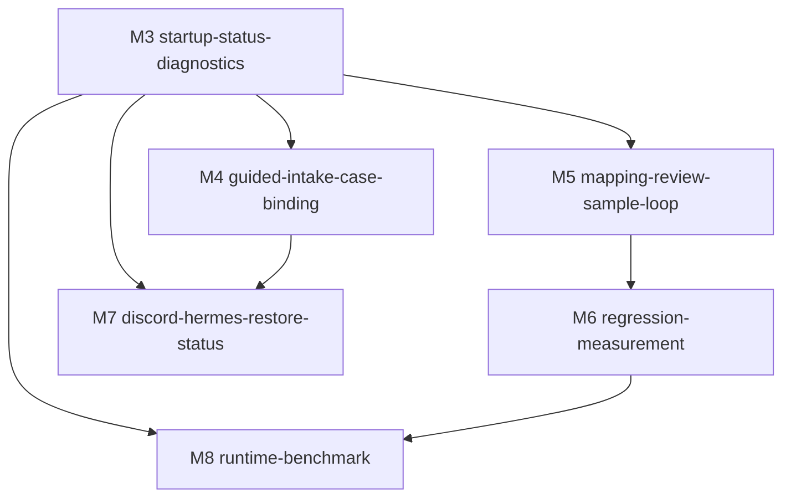

# legal-redactor workflow efficiency split

## Split Summary

This split keeps the work focused on the real operating flow, not only entity
recognition. The milestones are ordered so the user first gets a reliable local
status path, then simpler case intake, faster mapping/sample work, measurable
regression loops, remote restore visibility, and finally optional runtime
benchmarking.

Source documents:

- [REQUIREMENTS.md](REQUIREMENTS.md)
- [READINESS.md](READINESS.md)

## Milestone Overview

| Milestone | Time box | Scope | Requires | Blocks |
|---|---:|---|---|---|
| [M3-startup-status-diagnostics](milestones/M3-startup-status-diagnostics/README.md) | 5-7 days | One visible readiness/status path for Web, MLX, Office API, MCP config, Discord config, case root, wrong-port MLX diagnosis, invalid JSON config reporting, and pure-rule fallback. | none | M4, M5, M7, M8 |
| [M4-guided-intake-case-binding](milestones/M4-guided-intake-case-binding/README.md) | 6-8 days | Reduce manual case fields; suggest case root/folder/manifest/thread URL; expose save/bind/send/wait/fail states; warn on conflicting binding. | M3 | M7 |
| [M5-mapping-review-sample-loop](milestones/M5-mapping-review-sample-loop/README.md) | 7-10 days | Action-focused mapping review filters, preserved `map_reason`, safer sample-save summary, restore-risk warnings, and no context-dropping refresh. | M3 | M6 |
| [M6-regression-measurement](milestones/M6-regression-measurement/README.md) | 5-8 days | Newest-sample and gold-set regression workflow with correction counts, false-positive deletes, missing adds, unresolved placeholders, and timing metrics. | M5 | M8 |
| [M7-discord-hermes-restore-status](milestones/M7-discord-hermes-restore-status/README.md) | 7-10 days | Restore readiness/status from Discord thread id to Office API/MCP/local restored path, with privacy-preserving status/path/count responses. | M3, M4 | none |
| [M8-runtime-benchmark](milestones/M8-runtime-benchmark/README.md) | 5-7 days | Optional Rapid-MLX or runtime A/B benchmark using the same docs, samples, gold set, workflow timing, memory, and correction-count evidence. | M3, M6 | none |

## Dependency Graph



## Naming

Milestones use one directory layer under this planning domain:

```text
docs/planning/legal-redactor-workflow-efficiency/milestones/M<N>-<lowercase-kebab-purpose>/
```

The numbering starts at `M3` because the need/readiness work already created the
first two planning artifacts for this domain.

## Split Rationale

- `M3` is first because visible startup/config status reduces friction for every
  later workflow and avoids hiding failures behind Python, MLX, MCP, or Discord
  internals.
- `M4` and `M5` can follow `M3` independently: one simplifies intake/archive
  binding, the other simplifies mapping review/sample learning.
- `M6` depends on `M5` because correction and sample-save evidence should feed
  the measurement loop.
- `M7` depends on `M4` because restore-by-thread needs reliable local case/thread
  binding before remote status hardening is useful.
- `M8` stays last and optional because runtime acceleration only matters after
  workflow metrics can show total-time or reliability gains.

## Signoff Needs

| Need | Applies to | Required before |
|---|---|---|
| Office Mac remains authority for originals, maps, manifests, and restored output. | M4, M7 | Changing case binding or restore behavior |
| Auto-binding must not silently choose the wrong manifest or Discord thread. | M4, M7 | Build acceptance for suggestions/conflict warnings |
| Sensitive samples, maps, originals, and restored full text remain local/private. | M5, M6, M7 | Sample work and any GitHub delivery |
| Newest sample provenance is checked before rule tuning. | M5, M6 | Sample-driven recognition changes |
| Discord/Hermes credentials and private network checks are external live dependencies. | M7 | Live restore smoke |
| Runtime benchmark cannot change the default model without evidence. | M8 | Any runtime/model default change |

## Review Notes

This split uses the current local FFCS policy of `must_collect=[codex,grok]` and
`must_pass=[codex,grok]`. Grok custom CLI transport was smoke-tested through the
real `review-runner.mjs run` path before this split. The website sync config
still lacks the local `--no-plan --max-turns 8` hardening, so write-mode sync
should not be run until the website config is updated or the local override is
intentionally re-applied.
