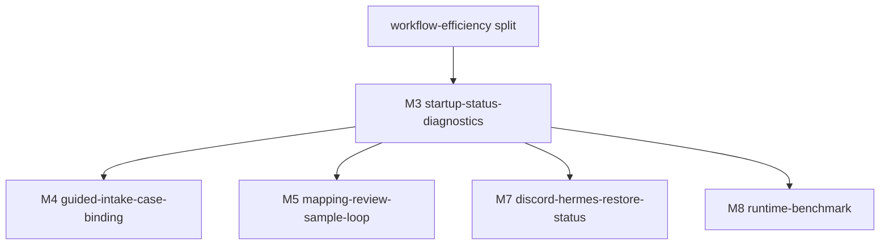

# M3-startup-status-diagnostics · startup-status-diagnostics · 模块门面

> **状态**:`Gate 2 PASS · Build complete`
> **依据**:[../../REQUIREMENTS.md](../../REQUIREMENTS.md), [../../READINESS.md](../../READINESS.md), [../../SPLIT.md](../../SPLIT.md)
> **复杂度**:`medium`
> **风险档**:`medium`
> **时间盒**:`5-7 days`
> **上游**:`legal-redactor-workflow-efficiency split`
> **下游**:`M4-guided-intake-case-binding`, `M5-mapping-review-sample-loop`, `M7-discord-hermes-restore-status`, `M8-runtime-benchmark`
> **版本**:v1.0 · 2026-06-27

---

## 一、依据

- [../../REQUIREMENTS.md](../../REQUIREMENTS.md) §6.1 defines startup, service control, and diagnostics requirements.
- [../../READINESS.md](../../READINESS.md) §4 lists current config surfaces and the local-config gap.
- [../../SPLIT.md](../../SPLIT.md) places this milestone first because it unlocks later workflow simplification.

This milestone is a spec for implementation work. It does not change product
code during `/ffcs:spec`.

## 二、目标

Give the daily user one visible readiness path for the local redaction workflow.
The user should be able to tell whether the app can run normally, should proceed
in pure-rule fallback, or needs a specific setup fix.

Completion definition for build:

- Web UI exposes a compact status surface and a machine-readable status endpoint.
- Status checks cover Web, MLX, local config JSON, case root, Office API config,
  MCP config, and Discord config without leaking secret values.
- The MLX path distinguishes ready, skipped, missing CLI, model mismatch,
  wrong-port occupant, unreachable, and startup timeout.
- Tests cover the status classifier and Web/API response shape.
- Gate 2 review passes with real `codex + grok` artifacts.

## 三、范围

### 3.1 In Scope

- Add a reusable Python diagnostics module under `legal_redactor/`.
- Add a Web status endpoint such as `/api/status`.
- Add a visible status panel or band on the Web UI first screen.
- Improve local config loading so missing files and invalid JSON can be reported
  distinctly by diagnostics while keeping current runtime-safe defaults.
- Keep `./start.sh` as the normal manual entrypoint and
  `scripts/start_mlx9b_server.sh` as the MLX startup gatekeeper.
- Document status meanings and smoke commands in the restore/deploy docs or the
  milestone docs.

### 3.2 Out of Scope

- Do not change the default MLX model.
- Do not add a model picker.
- Do not require cloud inference, OpenCode, or larger local models.
- Do not implement Discord/Hermes restore workflow changes; M3 only reports
  readiness and configuration status for those surfaces.
- Do not send restored full text, redaction maps, originals, API tokens, or
  Discord bot tokens through status responses.
- Do not make launchctl/Desktop launcher behavior mandatory for normal use.

### 3.3 关键交付物清单

| # | 文件路径 | 类型 | 备注 |
|---|---|---|---|
| 1 | `legal_redactor/status.py` | 代码 | New reusable diagnostics helpers and status DTOs |
| 2 | `legal_redactor/local_config.py` | 代码 | Add diagnostic config read result without breaking current `load_json_config` behavior |
| 3 | `legal_redactor/web_app.py` | 代码/UI | Add status endpoint and visible status surface |
| 4 | `tests/test_status.py` | 测试 | Pure classifier/unit tests |
| 5 | `tests/test_web_app.py` | 测试 | Endpoint/render tests for status integration |
| 6 | `docs/deploy/hermes-office-restore.md` | 文档 | Update operator smoke/status notes if status semantics touch restore docs |

## 四、决策表

| # | 决策主题 | 取值 | rationale | signoff_version | evidence_link |
|---|---|---|---|---|---|
| D-01 | 默认入口 | Keep `./start.sh` as the manual entrypoint and do not add a second launcher path. | Existing project instruction and runtime docs already make `start.sh` canonical; adding a second startup path would increase support burden. | v1.0 | `start.sh`, [../../READINESS.md](../../READINESS.md) §4 |
| D-02 | MLX 模型身份 | Keep `mlx-community/Qwen3.5-9B-MLX-4bit` as expected model id. | Current config tests and startup script already pin this model; runtime changes belong to M8 benchmark. | v1.0 | `scripts/start_mlx9b_server.sh`, `tests/test_llm_config.py` |
| D-03 | 状态响应安全 | Status responses may expose ready/degraded/missing/error and path existence, but never token values, map contents, originals, samples, or restored full text. | M3 touches operational state near sensitive surfaces; privacy boundaries must be locked before UI/API work. | v1.0 | [../../REQUIREMENTS.md](../../REQUIREMENTS.md) §8 |
| D-04 | Config 读取兼容 | Keep `load_json_config` returning `{}` for existing callers; add a separate diagnostic path that reports missing/invalid/non-object JSON. | Existing code expects safe defaults; diagnostics need more detail without changing every caller in this milestone. | v1.0 | `legal_redactor/local_config.py` |
| D-05 | Office/Hermes 范围 | M3 checks Office API and MCP configuration/reachability only; restore behavior remains unchanged. | Restore-by-thread implementation belongs to M7; M3 should only make readiness visible. | v1.0 | `legal_redactor/remote_api.py`, `legal_redactor/mcp_adapter.py` |
| D-06 | Fallback 展示 | Pure-rule fallback must be visible when MLX is skipped/unavailable, but should not be described as equivalent quality. | The app should remain usable while making lower recognition support explicit. | v1.0 | `start.sh`, [../../REQUIREMENTS.md](../../REQUIREMENTS.md) §5 |

### 4.1 可选项

No user-facing design choice is blocked at spec time. The build can choose the
smallest UI placement that fits the existing Web UI; any larger navigation
change should be deferred.

## 五、七层硬门槛 / 选型

七层条数预估:

| 层 | 预估条数 | 备注 |
|---|---|---|
| D | 6 | Status schema, safe config diagnostics, fixed model identity, no secret echo |
| P | 5 | Pure probes/classifiers for MLX, config files, case root, Discord, MCP |
| S | 2 | Probe timeouts and no startup blocking |
| N | 1 | Discord/Hermes readiness is reported only, no outbound notification side effect |
| C+A | 3 | Web endpoint, first-screen panel, existing health remains stable |
| T | 5 | Unit and Web tests plus service smoke commands |
| E | 4 | Docs/runbook, env names, cache path note, fallback wording |

## 六、依赖图



## 七、上下游依赖

### 7.1 上游

- Upstream split completed with `codex + grok` review artifacts under
  `.ff-state/reviews/legal-redactor-workflow-efficiency-split`.
- Upstream planning docs are the only product requirements source for this spec.

### 7.2 下游

- `M4` and `M5` should reuse the status/config diagnostic helpers instead of
  adding independent config readers.
- `M7` should reuse Office API/MCP readiness fields for restore status hardening.
- `M8` should reuse MLX model identity and timing probes for benchmark evidence.

## 八、风险 + 缓解

| 风险 | 影响 | 缓解 |
|---|---|---|
| Status endpoint leaks secret-derived values | Privacy breach | Return presence and masked path/status only; tests assert token values do not appear |
| Diagnostics blocks normal redaction startup | Worse daily workflow | Use short timeouts and graceful degraded states; status panel must not prevent `/redact` |
| Config diagnostics changes existing default behavior | Regression in Discord/API/MCP callers | Keep existing `load_json_config` behavior and add separate diagnostic result |
| MLX probe mislabels wrong service as ready | User continues with broken LLM path | Require `/v1/models` and expected model id match |
| UI becomes a large dashboard | More complexity than value | Use compact panel with details available via JSON endpoint |

## 九、时间盒

| Step | 估时 | 备注 |
|---|---|---|
| Step 0 · POC +防护栏 | 0.5 day | Confirm current probes and doc-check baseline |
| Step 1 · status schema + probes | 2 days | `legal_redactor/status.py`, local config diagnostics |
| Step 2 · Web endpoint + first-screen panel | 2 days | `/api/status`, compact UI |
| Step 3 · tests + docs | 1.5 days | focused pytest and operator notes |
| Step 4 · self-review + Gate 2 | 1 day | review artifacts and closeout |
| **总计** | **5-7 days** | Medium complexity, standard profile |

**断路触发**: probe design fails the same way three times, status surface needs
remote credentials to proceed, or tests expose a required product decision
outside M3 scope.

## 十、本 milestone 五件套清单

| 件 | 文件 | 说明 |
|---|---|---|
| 1 · README | [本文件](README.md) | Milestone door and decisions |
| 2 · EXECUTION_PLAN | [EXECUTION_PLAN.md](EXECUTION_PLAN.md) | Hard gates and build steps |
| 3 · HUMAN_TASKS | [HUMAN_TASKS.md](HUMAN_TASKS.md) | Physical/external work only |
| 4 · step-0-poc-report | [step-0-poc-report.md](step-0-poc-report.md) | POC commands and fallback design |
| 5 · _progress | [_progress.md](_progress.md) | Gate, grep trace, DoD, handoff status |

## 十一、Gate 0a 结果

- Effective reviewers: `codex`, `grok`.
- `codex-r1`: PASS.
- `grok-r1`: PASS.
- Chair signoff: PASS.
- Gate proof: `all_pass=true`.
- Next command:

```text
/ffcs:build M3-startup-status-diagnostics
```
