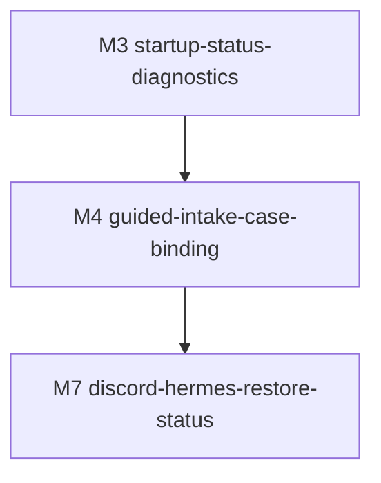

# M4-guided-intake-case-binding · guided-intake-case-binding · 模块门面

> **状态**:`Gate 2 PASS · Build complete`
> **依据**:[../../REQUIREMENTS.md](../../REQUIREMENTS.md), [../../READINESS.md](../../READINESS.md), [../../SPLIT.md](../../SPLIT.md)
> **复杂度**:`medium`
> **风险档**:`medium`
> **时间盒**:`6-8 days`
> **上游**:`M3-startup-status-diagnostics`
> **下游**:`M7-discord-hermes-restore-status`
> **版本**:v1.0 · 2026-06-29

---

## 一、依据

- [../../REQUIREMENTS.md](../../REQUIREMENTS.md) §6.2 requires fewer manual
  case fields, case suggestions, visible save/bind/send/wait/fail states, manual
  override, and conflict warnings.
- [../../SPLIT.md](../../SPLIT.md) places M4 after M3 and before M7 because
  restore-by-thread needs reliable local case/thread binding.
- M3 delivered status/config diagnostics and confirms the Web entrypoint can
  expose compact operational state without leaking sensitive maps or originals.

This milestone is a spec for implementation work. It does not change product
code during `/ffcs:spec`.

## 二、目标

Make the daily intake/archive path require fewer manual fields and fewer hidden
decisions. The user should be able to upload or paste a document, see a strong
case suggestion when local evidence exists, save the redacted output to the
right case, and understand whether the case is local-only, Discord-bound,
waiting on Hermes, sent to Discord, or blocked by a conflict.

Completion definition for build:

- Case suggestion returns structured evidence, confidence, and conflict status
  from local facts such as filename matches, selected source folder, manifest,
  and existing Discord thread binding.
- The Web flow shows one explicit case workflow state:
  `not_saved`, `saved_local`, `bound_thread`, `sent_discord`,
  `waiting_hermes`, or `attach_failed`.
- Manual override stays possible, but conflicting manifest/thread bindings
  cannot be overwritten silently.
- Server-side code recomputes binding and workflow state from manifest/local
  facts; browser-submitted decision fields such as `state`, `status`, `bound`,
  `sent`, or `conflict_result` are rejected with `INVALID_INPUT`.
- Tests cover `cases.py` helpers, Web suggestion/API shape, conflict warnings,
  local save, Hermes wait, and Discord attach results.
- Gate 0a and Gate 2 review pass with real `codex + grok` artifacts.

## 三、范围

### 3.1 In Scope

- Add or refactor helper functions in `legal_redactor/cases.py` for case
  suggestion, conflict detection, manifest/thread binding status, and safe
  public state output.
- Extend `legal_redactor/web_app.py` so `/api/suggest-case-location`, redaction
  result rendering, Hermes create/wait, and Discord attach share one status
  vocabulary.
- Preserve current upload/paste, mapping review, sample save, and restore
  behavior unless required to carry case context through the result page.
- Add tests in `tests/test_cases.py` and `tests/test_web_app.py` for suggestion
  scoring, ambiguous matches, conflicting manifest/thread bindings, manual
  override warnings, and workflow state rendering.
- Reuse M3 `/api/status` and config diagnostics only as readiness context; M4
  should not duplicate startup probes.

### 3.2 Out of Scope

- Do not change redaction recognition rules, MLX model identity, or sample
  learning behavior.
- Do not implement full Discord/Hermes restore status; M7 owns restore-by-thread
  visibility.
- Do not send originals, redaction maps, restored full text, or samples to
  Discord/Hermes.
- Do not send local absolute paths such as `case_root` or `source_dir` to
  Discord/Hermes command messages.
- Do not require live Discord credentials for unit tests or normal redaction.
- Do not add a new launcher or second Web entrypoint.

### 3.3 关键交付物清单

| # | 文件路径 | 类型 | 备注 |
|---|---|---|---|
| 1 | `legal_redactor/cases.py` | 代码 | Case suggestion/conflict/status helpers |
| 2 | `legal_redactor/web_app.py` | 代码/UI/API | Shared case workflow state, warnings, and UI rendering |
| 3 | `tests/test_cases.py` | 测试 | Pure case binding and conflict tests |
| 4 | `tests/test_web_app.py` | 测试 | Web API/render tests for intake and workflow state |
| 5 | `docs/planning/legal-redactor-workflow-efficiency/milestones/M4-guided-intake-case-binding/*` | 文档 | Spec/progress/handoff evidence |

## 四、决策表

| # | 决策主题 | 取值 | rationale | signoff_version | evidence_link |
|---|---|---|---|---|---|
| D-01 | 默认入口 | Keep the existing `/` Web intake form and `/redact` path; no second launcher or wizard page. | Current workflow already centers on the Web form; a separate wizard would add choices instead of removing them. | v1.0 | `legal_redactor/web_app.py` index form |
| D-02 | 案件权威 | Office Mac local case manifest remains the authority for case folder, thread id, mapping path, and redacted files. | Requirements and split both state that originals/maps/manifests stay local and authoritative. | v1.0 | [../../REQUIREMENTS.md](../../REQUIREMENTS.md) §3, §6.6 |
| D-03 | 状态词表 | Use one server-generated vocabulary: `not_saved`, `saved_local`, `bound_thread`, `sent_discord`, `waiting_hermes`, `attach_failed`. | The user needs one visible state instead of scattered pending/success/error text across buttons. | v1.0 | [../../REQUIREMENTS.md](../../REQUIREMENTS.md) §6.2 |
| D-04 | 绑定重算 | Web clients may submit raw facts only; server recomputes suggestion/binding/workflow state from manifest, path, thread URL, and Discord attach results. | State and binding are decision-like; client-supplied final state must not be trusted. | v1.0 | [EXECUTION_PLAN.md](EXECUTION_PLAN.md) §6 |
| D-05 | 冲突策略 | Existing manifest/thread binding cannot be overwritten unless build adds an explicit conflict warning and user confirmation field. | Auto-binding must not silently choose the wrong manifest/thread. | v1.0 | [../../SPLIT.md](../../SPLIT.md) Signoff Needs |
| D-06 | 手动覆盖 | Keep manual case root/folder/thread fields; auto-suggestions prefill only when strong or user accepts ambiguous result. | Daily workflow should be simpler but still recoverable when file names are weak or case folders collide. | v1.0 | `legal_redactor/web_app.py` intake form |
| D-07 | Discord 范围 | M4 can request Hermes thread creation and send redacted attachments, but must not implement restore status or restored-output posting. | Restore visibility and privacy hardening are M7; M4 only needs reliable local binding state. | v1.0 | [../../SPLIT.md](../../SPLIT.md) M4/M7 dependency |
| D-08 | 外发元数据白名单 | Discord/Hermes outbound messages may include request id, sanitized case folder/title/cause, and redacted attachment metadata only; they must not include `case_root`, `source_dir`, originals, maps, restored text, samples, or local absolute paths. | Current create-thread flow can carry local path fields, so M4 must harden the privacy boundary before treating attach/wait states as signed. | v1.0 | `legal_redactor/web_app.py` `_case_creation_command` |

### 4.1 可选项

The build may choose the exact UI placement for state chips, warnings, and
suggestion evidence as long as the first redaction result screen remains the
primary workflow surface and all states are testable through server-rendered
HTML or JSON.

## 五、七层硬门槛 / 选型

七层条数预估:

| 层 | 预估条数 | 备注 |
|---|---|---|
| D | 8 | State vocabulary, manifest authority, raw-fact input, conflict contract, outbound metadata allowlist |
| P | 5 | Suggestion scoring, manifest read, thread parsing, conflict detector, state reducer |
| S | 2 | Bounded filesystem search and no duplicate write/attach on retry |
| N | 3 | Hermes/Discord passive wait states, redacted-only attachment, outbound path privacy |
| C+A | 4 | Suggest API shape, intake prefill, result state panel, warning/confirm path |
| T | 5 | cases/web tests plus browser/manual smoke plan |
| E | 3 | Docs/progress, privacy note, M7 handoff |

## 六、依赖图



## 七、上下游依赖

### 7.1 上游

- M3 Gate 2 completed with `codex + grok` artifacts and wrote handoff to
  `/ffcs:spec M4-guided-intake-case-binding`.
- M3 status/config helpers may be reused for readiness display but are not the
  source of case-binding truth.

### 7.2 下游

- M7 should reuse the case/thread state vocabulary and manifest conflict rules
  rather than creating a separate restore binding model.
- M5 mapping review should preserve the case context through sample-saving
  flows if those flows render inside the same result page later.

## 八、风险 + 缓解

| 风险 | 影响 | 缓解 |
|---|---|---|
| Auto-suggestion chooses the wrong case | Redacted output or thread binding lands in the wrong archive | Score suggestions from multiple raw facts, show evidence, and require explicit confirmation for conflicts/ambiguity |
| Browser-supplied state is trusted | User or stale page can mark a case as bound/sent incorrectly | Server-side authoritative recompute gates D4/S1 |
| Existing manifest is overwritten | Restore path breaks or M7 resolves wrong thread | Conflict detector blocks different thread id unless confirm field is present |
| Local paths leak through Hermes create-thread | Discord sees Office Mac paths or source directories | D-08/N3 require an outbound metadata allowlist and tests that `case_root`/`source_dir` are absent |
| Discord/Hermes status expands into restore behavior | Scope creep and privacy risk | Keep M4 to create/wait/attach state; M7 owns restore status |
| UI adds too much workflow text | Daily redaction gets slower | Use compact state chips/warnings near existing fields and result buttons |

## 九、时间盒

| Step | 估时 | 备注 |
|---|---|---|
| Step 0 · POC +防护栏 | 0.5 day | Confirm current suggestion and conflict surfaces |
| Step 1 · case helpers/state model | 2 days | `cases.py` suggestion/conflict/status helpers |
| Step 2 · Web API/UI integration | 2 days | Suggest API, prefill evidence, result state display |
| Step 3 · Discord/Hermes attach states | 1.5 days | Unified wait/sent/fail states without restore scope or local path leakage |
| Step 4 · tests + docs + Gate 2 | 1.5-2 days | Focused pytest, smoke, review-repair |
| **总计** | **6-8 days** | Medium complexity, medium risk |

**断路触发**: same suggestion/conflict design fails three times, live Discord
credentials become required for build tests, or a product decision is needed
about overwriting existing manifest/thread bindings beyond D-05.

## 十、本 milestone 五件套清单

| 件 | 文件 | 说明 |
|---|---|---|
| 1 · README | [本文件](README.md) | Milestone door and decisions |
| 2 · EXECUTION_PLAN | [EXECUTION_PLAN.md](EXECUTION_PLAN.md) | Hard gates and build steps |
| 3 · HUMAN_TASKS | [HUMAN_TASKS.md](HUMAN_TASKS.md) | Physical/external work only |
| 4 · step-0-poc-report | [step-0-poc-report.md](step-0-poc-report.md) | POC commands and fallback design |
| 5 · _progress | [_progress.md](_progress.md) | Gate, grep trace, DoD, handoff status |

## 十一、Gate 0a 结果

- Effective reviewers: `codex`, `grok`.
- `codex-r0`: FAIL with 1 BLOCKER and 1 HIGH; repaired.
- `codex-r1`: PASS.
- `grok-r0`: PASS and carried forward under local `max_review_repair_rounds=1`.
- Chair signoff: PASS.
- Gate proof: `all_pass=true`.
- Next command after Gate 0a PASS:

```text
/ffcs:build M4-guided-intake-case-binding
```

## 十二、Gate 2 结果

- Effective reviewers: `codex`, `grok`.
- `codex-r0`: FAIL with 1 BLOCKER and 2 HIGH; repaired.
- `grok-r0`: FAIL with 2 BLOCKER and 2 HIGH; repaired.
- `codex-r1`: PASS.
- `grok-r1`: PASS.
- Chair signoff: PASS with `decision=pass_defer`.
- Gate proof: `evaluateGateProof all_pass=true`.
- Validation: focused M4/M3 suite 67 passed; full pytest 165 passed;
  `git diff --check` passed.
- Deferred follow-ups: clarify fail-closed overwrite wording or add an explicit
  confirmation flag; optional UI assertion for ambiguous/conflict toast copy;
  optional corrupt-manifest public error state; optional local re-save
  preserving existing thread unit test.
