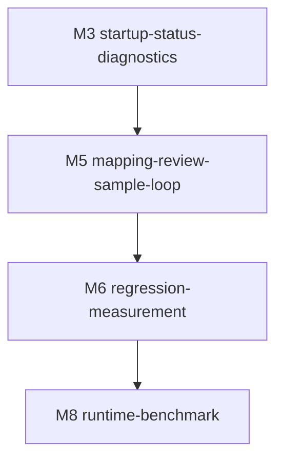

# M5-mapping-review-sample-loop · mapping-review-sample-loop · 模块门面

> **状态**:`Build complete · Gate 2 PASS`
> **依据**:[../../REQUIREMENTS.md](../../REQUIREMENTS.md), [../../READINESS.md](../../READINESS.md), [../../SPLIT.md](../../SPLIT.md)
> **复杂度**:`complex`
> **风险档**:`medium`
> **时间盒**:`7-10 days`
> **上游**:`M3-startup-status-diagnostics`
> **下游**:`M6-regression-measurement`
> **版本**:v1.0 · 2026-06-29

---

## 一、依据

- [../../REQUIREMENTS.md](../../REQUIREMENTS.md) §6.3 requires action-focused
  mapping review, `map_reason` preservation, sample-save summaries, delete
  blacklist safeguards, restore-risk warnings, and refreshless sample saving.
- [../../SPLIT.md](../../SPLIT.md) places M5 after M3 and before M6 because
  correction/sample evidence should feed the regression measurement loop.
- Current code already carries `map_reason` through some edit/save paths and
  has sample guards for short person deletes and one-character province
  abbreviations; M5 locks those as contracts and fills the workflow gaps.

This milestone is a spec for implementation work. It does not change product
code during `/ffcs:spec`.

## 二、目标

Make the mapping review and sample-learning loop faster, safer, and less
fragile. The user should review only rows that need attention, understand why a
row exists, save corrections without losing page context, and see what the
sample library will learn before future runs use it.

Completion definition for build:

- Mapping review exposes action-focused filters or views for low-confidence,
  manually added, modified, deleted/false-positive, restore-risk, and
  sample-reused rows.
- `map_reason` survives redaction result rendering, manual row insertion,
  edited-map application, sample saving, and sample editing.
- Sample save returns a structured summary covering lookup entries, delete
  blacklist candidates, suppressed risky entries, and suggested regression
  checks.
- Existing safeguards for short person delete samples and one-character
  province abbreviation lookup samples remain enforced by tests.
- Sample save does not navigate or refresh away the current mapping review page.
- Sensitive `samples/_auto.sample.json` data remains local and ignored by Git.
- Gate 0a, Gate 0b, and Gate 2 review pass with real `codex + grok` artifacts.

## 三、范围

### 3.1 In Scope

- Add UI/API support in `legal_redactor/web_app.py` for row classification,
  action filters, restore-risk warnings, sample-save summary rendering, and
  refreshless state preservation.
- Add or refactor helpers in `legal_redactor/_samples.py` for sample summary
  classification, risky-delete suppression reporting, lookup eligibility, and
  newest-sample handoff metadata.
- Extend `tests/test_sample_integration.py` and relevant Web tests for
  `map_reason`, sample-save summary, filter classification, risky delete
  suppression, province abbreviation guard, and refreshless save behavior.
- Keep M4 case context fields intact when mapping review forms re-render after
  apply/edit/save actions.
- Record downstream handoff fields that M6 can use for correction counts,
  false-positive deletes, missing adds, restore unresolved placeholders, and
  newest-sample provenance.

### 3.2 Out of Scope

- Do not rewrite the recognition pipeline or replace the hybrid rule plus LLM
  architecture.
- Do not change the default MLX model or runtime.
- Do not tune rules from sensitive samples during this spec; M6 owns broader
  measurement and newest-sample regression workflow.
- Do not commit, upload, paste, or expose actual contents of
  `samples/_auto.sample.json`.
- Do not send sample content, maps, originals, or restored full text to
  Discord/Hermes.
- Do not add a second mapping-review application; the existing result page
  remains the primary workflow surface.

### 3.3 关键交付物清单

| # | 文件路径 | 类型 | 备注 |
|---|---|---|---|
| 1 | `legal_redactor/web_app.py` | 代码/UI/API | Mapping row classification, filters, warnings, refreshless sample save |
| 2 | `legal_redactor/_samples.py` | 代码 | Sample summary and guard helpers |
| 3 | `tests/test_sample_integration.py` | 测试 | Sample-save and sample-library behavior |
| 4 | `tests/test_web_app.py` | 测试 | Web result page, filters, save iframe/message behavior |
| 5 | `.gitignore` | 配置 | Keep required M5 tests trackable while `samples/` stays ignored |
| 6 | `docs/planning/legal-redactor-workflow-efficiency/milestones/M5-mapping-review-sample-loop/*` | 文档 | Spec/progress/POC/POST_GA evidence |

## 四、决策表

| # | 决策主题 | 取值 | rationale | signoff_version | evidence_link |
|---|---|---|---|---|---|
| D-01 | 默认界面 | Keep the existing Web redaction result page as the mapping-review surface; add filters and warnings in place. | Requirements ask to reduce review work, not create another app or page. | v1.0 | [../../REQUIREMENTS.md](../../REQUIREMENTS.md) §6.3 |
| D-02 | 行分类 | Compute row categories from server-known map data and edit form facts: low-confidence (`confidence < 0.85` or existing `review_candidates` membership), manual-added, modified, delete-candidate, restore-risk, and sample-reused. | Filters must be testable and consistent between rendered rows and sample-save summary. | v1.0 | `legal_redactor/web_app.py` mapping form, `legal_redactor/pipeline.py:354-359` |
| D-03 | 原因字段 | Preserve `map_reason` as user-facing rationale and sample reason across edit/apply/save/sample-edit paths. | Prior work added reasons; losing them makes sample review opaque. | v1.0 | `web_app.py:1003-1013`, `web_app.py:1059-1128` |
| D-04 | 样本摘要 | Sample save returns structured counts and row labels for lookup entries, delete blacklist candidates, suppressed risky entries, and suggested regression checks. | The user needs to know what future behavior will change before trusting samples. | v1.0 | [../../REQUIREMENTS.md](../../REQUIREMENTS.md) §6.3 |
| D-05 | 风险删除 | Keep current short-person delete and one-character province-abbreviation protections as hard gates. | Risky samples can reduce recall or corrupt legal/case references. | v1.0 | `legal_redactor/_samples.py`, `tests/test_sample_integration.py` |
| D-06 | 无刷新保存 | Sample save must complete through in-page message/update behavior without replacing the mapping review page or dropping current filters/scroll/edit context. | The user's correction context is the work surface; refresh loses the review state. | v1.0 | `web_app.py:1130-1146`, `web_app.py:2770-2774` |
| D-07 | 本地样本边界 | Actual sample data stays local under `samples/`, is ignored by Git, and is never used as committed evidence. | Sensitive originals and corrections can appear in sample data. | v1.0 | `.gitignore:9`, [../../SPLIT.md](../../SPLIT.md) Signoff Needs |
| D-08 | M6 数据交接 | M5 emits summary fields that M6 can measure: manual corrections, false-positive deletes, missing adds, suppressed risky rows, restore unresolved placeholders, newest-sample provenance, and suggested regression commands. | M6 depends on correction/sample evidence; M5 should avoid a second parser later. | v1.0 | [../../SPLIT.md](../../SPLIT.md) M5/M6 dependency |
| D-09 | 服务端权威 | Browser-submitted filter/status labels are display hints only; sample-save behavior is recomputed from original map, edited rows, delete flags, sample guards, and restore flags. | Filter/status/risk are decision-like fields and cannot be trusted from the client. | v1.0 | [EXECUTION_PLAN.md](EXECUTION_PLAN.md) §6 |

### 4.1 可选项

The build may choose tabs, chips, segmented controls, or compact toolbar
buttons for filters, as long as each category is keyboard/browser-testable and
does not hide the existing edit/apply/save controls.

### 4.2 Sample Summary Schema Sketch

The build should keep the first implementation small, but the save response
must expose stable keys that M6 can consume without reading raw sample files:

| key | type | meaning |
|---|---|---|
| `lookup_entries` | list/count | Add/modify rows that may become future lookup samples |
| `delete_blacklist_candidates` | list/count | Delete rows eligible for future blacklist behavior |
| `suppressed_risky_entries` | list/count | Rows blocked by short-person, province-abbreviation, or restore-risk guards |
| `manual_corrections` | integer | Total add/modify/delete corrections saved or suppressed |
| `false_positive_deletes` | integer | Delete rows representing false-positive recognitions |
| `missing_adds` | integer | Manually added rows representing missed entities |
| `restore_unresolved_placeholders` | integer/null | Optional unresolved placeholder count when restore preview evidence is available |
| `newest_sample_provenance` | object/null | Timestamp/source/file metadata sufficient for M6 provenance checks without exposing sample contents |
| `regression_suggestions` | list[string] | Focused commands or test names to run next |

The response may travel as JSON in a `postMessage` payload or an equivalent
testable in-page update, but the key names above are the spec-time contract.

## 五、七层硬门槛 / 选型

M5 is classified as complex because the time box is 7-10 days, the build touches
Web UI/API plus sample helpers plus downstream M6 evidence, and the hard gates
cover more than 20 items. Risk remains medium because no external credential,
payment, DB migration, or restored-output publishing is introduced.

七层条数预估:

| 层 | 预估条数 | 备注 |
|---|---|---|
| D | 9 | Row classification, `map_reason`, sample summary schema, guard contracts, local sample boundary |
| P | 5 | Pure row classifier, sample summary builder, restore-risk classifier, guard helpers, M6 handoff projector |
| S | 3 | Server recompute, bounded form parsing, no duplicate sample writes on refresh/retry |
| N | 2 | In-page notification/toast summary and no Discord/Hermes sample notification |
| C+A | 5 | Review filters, result warning, sample-save summary, refreshless state, browser smoke |
| T | 6 | Sample, Web, guard, full/focused, Git sensitive-data audit and tracked-test audit |
| E | 4 | Docs, progress, M6 handoff, POST_GA observation |

## 六、依赖图

## 七、上下游依赖

### 7.1 上游

- M3 supplies readiness/status context and keeps the Web entrypoint stable.
- M4 case-context fields should be preserved through M5 form re-renders and
  sample-save flows.

### 7.2 下游

- M6 should consume M5 summary fields rather than re-diffing raw sample files
  for correction counts.
- M8 can later use M6 metrics to compare runtime changes; M5 should not change
  runtime defaults.

## 八、风险 + 缓解

| 风险 | 影响 | 缓解 |
|---|---|---|
| Sample delete entries suppress true entities | Lower recall and unsafe redaction | Preserve short-person delete guard, exact sample guard tests, and regression suggestions |
| One-character province abbreviation becomes a global lookup | Case citations and license/case numbers can be corrupted | Keep `_sample_lookup_allowed` one-character province check as BLOCKER |
| Filter labels are trusted from the browser | Malicious/stale page can misclassify sample actions | Server recomputes summary from raw edited rows and sample guards |
| Refreshless save writes duplicate samples on retry | Sample file churn and confusing summary counts | Use idempotent merge rules and tests for repeated save/update paths |
| Sample summary exposes sensitive originals in logs or docs | Privacy breach | Keep real sample content out of committed docs; tests use synthetic values only |
| UI filters hide critical rows by default | User misses restore-risk or delete candidates | Default view shows all rows with action counters; filters narrow only on explicit user action |
| M6 cannot measure M5 output | Later regression loop repeats work | Include M6 handoff summary schema in M5 closeout |

## 九、时间盒

| Step | 估时 | 备注 |
|---|---|---|
| Step 0 · POC + 防护栏 | 1 day | Confirm current edit/sample paths, row metadata, and no-refresh save behavior |
| Step 1 · row classifier + sample summary helpers | 2 days | Pure helpers in Web/sample boundary |
| Step 2 · review filters + restore-risk UI | 2 days | Result page controls and rendered row classes/counters |
| Step 3 · refreshless sample save + M6 handoff | 2 days | Structured summary, duplicate/retry safety, downstream fields |
| Step 4 · tests + docs + Gate 2 | 2-3 days | Focused/full tests, browser smoke, sensitive-data audit, review |
| **总计** | **7-10 days** | Complex complexity, medium risk |

**断路触发**: same sample-save context-loss bug recurs three times, sample
summary cannot avoid sensitive-data exposure, or POC shows the existing result
page cannot support filters without a larger UI split.

## 十、本 milestone 文档清单

| 件 | 文件 | 说明 |
|---|---|---|
| 1 · README | [本文件](README.md) | Milestone door and decisions |
| 2 · EXECUTION_PLAN | [EXECUTION_PLAN.md](EXECUTION_PLAN.md) | Hard gates and build steps |
| 3 · HUMAN_TASKS | [HUMAN_TASKS.md](HUMAN_TASKS.md) | Physical/external work only |
| 4 · step-0-poc-report | [step-0-poc-report.md](step-0-poc-report.md) | POC commands, findings, and fallback design |
| 5 · _progress | [_progress.md](_progress.md) | Gate, grep trace, DoD, handoff status |
| 6 · POST_GA_OBSERVATION | [POST_GA_OBSERVATION.md](POST_GA_OBSERVATION.md) | Complex milestone observation plan |

## 十一、Gate 0a 结果

- Status: PASS.
- Effective reviewers: `codex`, `grok`.
- Artifacts:
  - `.ff-state/reviews/M5-mapping-review-sample-loop-gate0a/artifacts/codex-r1.json` · PASS
  - `.ff-state/reviews/M5-mapping-review-sample-loop-gate0a/artifacts/grok-r1.json` · PASS
  - `.ff-state/reviews/M5-mapping-review-sample-loop-gate0a/chair-signoff.json` · PASS · `pass_defer`
- Machine proof: `all_pass=true`, `peer_all_pass=true`, `failed=[]`.

## 十二、Gate 0b 结果

- Status: PASS.
- Step 0 POC result: E-1, E-2, E-3, and Defense marked `非阻塞` / PASS with concrete code/test evidence in [step-0-poc-report.md](step-0-poc-report.md).
- Effective reviewers: `codex`, `grok`.
- Artifacts:
  - `.ff-state/reviews/M5-mapping-review-sample-loop-gate0b/artifacts/codex-r0.json` · PASS
  - `.ff-state/reviews/M5-mapping-review-sample-loop-gate0b/artifacts/grok-r0.json` · PASS
  - `.ff-state/reviews/M5-mapping-review-sample-loop-gate0b/chair-signoff.json` · PASS · `pass_defer`
- Machine proof: `all_pass=true`, `peer_all_pass=true`, `failed=[]`.
- Next command completed: `/ffcs:build M5-mapping-review-sample-loop`.

## 十三、Gate 2 结果

- Status: PASS.
- Effective reviewers: `codex`, `grok`.
- Fresh validation:
  - `.ff-state/logs/M5-build-focused-2026-06-29.log` · `60 passed, 6 subtests passed`
  - `.ff-state/logs/M5-build-full-pytest-2026-06-29.log` · `170 passed, 11 subtests passed`
  - `.ff-state/logs/M5-build-browser-smoke-2026-06-29.json` · synthetic browser smoke PASS
  - `.ff-state/logs/M5-build-milestone-doc-check-gate2-2026-06-29.log` · `findings=0`
- Artifacts:
  - `.ff-state/reviews/M5-mapping-review-sample-loop-gate2/artifacts/codex-r1.json` · PASS
  - `.ff-state/reviews/M5-mapping-review-sample-loop-gate2/artifacts/grok-r1.json` · PASS
  - `.ff-state/reviews/M5-mapping-review-sample-loop-gate2/chair-signoff.json` · PASS · `pass_defer`
- Machine proof: `all_pass=true`, `peer_all_pass=true`, `failed=[]`.
- Next command: `/ffcs:spec M6-regression-measurement`.
