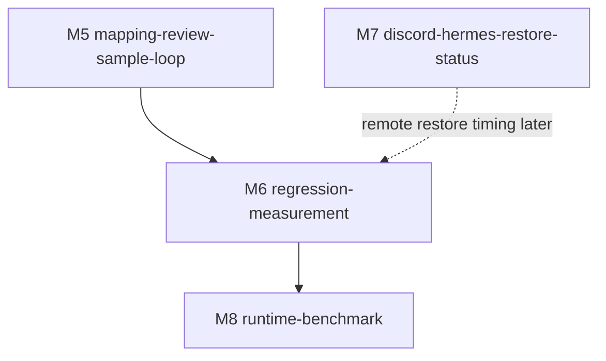

# M6-regression-measurement · regression-measurement · 模块门面

> **状态**:`Build complete · Gate 0a PASS · Gate 0b PASS · Gate 2 PASS`
> **依据**:[../../REQUIREMENTS.md](../../REQUIREMENTS.md), [../../SPLIT.md](../../SPLIT.md), [../M5-mapping-review-sample-loop/README.md](../M5-mapping-review-sample-loop/README.md)
> **复杂度**:`complex`
> **风险档**:`medium`
> **时间盒**:`5-8 days`
> **上游**:`M5-mapping-review-sample-loop`
> **下游**:`M8-runtime-benchmark`
> **版本**:v1.0 · 2026-06-29

---

## 一、依据

- [../../REQUIREMENTS.md](../../REQUIREMENTS.md) §6.4 requires recognition
  regression measurement for precision, recall, F1, manual corrections,
  false-positive deletes, missing adds, unresolved restore placeholders, and
  workflow timing.
- [../../SPLIT.md](../../SPLIT.md) places M6 after M5 because M5 now emits
  correction/sample-save evidence that can feed a measurement loop.
- M5 Gate 2 closed with stable `sample_summary` keys and the explicit followup:
  M6 must consume those keys without reading raw sensitive sample files.
- Current code already has gold-set evaluation through
  `python -m legal_redactor --eval-gold ... --eval-report ...`, plus
  sample-library and restore preview helpers that can be measured with
  synthetic fixtures.

## 二、目标

Build a repeatable measurement loop before changing recognition rules again.
The user should be able to answer: did a sample/rule/prompt change improve
recognition, did it create unsafe false positives, and did it reduce daily
manual review effort?

Completion definition for build:

- Gold-set evaluation remains available. M6's default regression report emits
  aggregate precision/recall/F1 plus sanitized per-case counts only; it must not
  embed raw `matched`/`missing`/`extra` entity originals or masks.
- M5 `sample_summary` payloads can be aggregated into workflow metrics:
  `manual_corrections`, `false_positive_deletes`, `missing_adds`,
  `suppressed_risky_entries`, `restore_unresolved_placeholders`,
  `newest_sample_provenance`, and `regression_suggestions`.
- Newest-sample provenance is verified by local metadata before any
  sample-driven tuning, without printing or committing actual sample entries.
- A privacy-safe regression report can compare baseline versus candidate runs
  and list focused follow-up tests or commands.
- Restore unresolved placeholders are counted from restore preview evidence
  when redacted text and a map are available.
- Timing fields are captured for local evaluation/redaction/report generation
  and for document input to saved case when input/save timestamps are supplied;
  Discord-to-restore timing is reserved for M7 unless M7 state is already
  available.
- Gate 0a, Gate 0b, and Gate 2 review pass with real `codex + grok` artifacts.

## 三、范围

### 3.1 In Scope

- Add a small regression measurement surface around existing code, likely
  `legal_redactor/regression.py` plus CLI wiring in `legal_redactor/__main__.py`
  and/or `legal_redactor/cli.py`.
- Reuse `legal_redactor/evaluation.py` for gold-set metrics instead of
  replacing evaluator semantics. Preserve existing `--eval-report`
  diagnostics, but project them into a privacy-safe M6 `gold` section by
  default.
- Add helpers that aggregate M5 `sample_summary` JSON payloads and local sample
  provenance metadata into sanitized metrics.
- Add restore placeholder counting from `preview_restore()` or equivalent text
  scan against known map placeholders.
- Add synthetic tests for report schema, summary aggregation, newest-sample
  provenance redaction, threshold exits, and timing fields.
- Update README/operator docs with commands for local measurement and safe
  newest-sample handling.

### 3.2 Out of Scope

- Do not tune recognition rules, prompts, or model defaults during M6 spec.
  Build may add measurement commands; actual rule changes require measured
  evidence and focused tests.
- Do not read, paste, commit, or review actual `samples/_auto.sample.json`
  contents in docs, review material, or Git artifacts.
- Do not expose raw originals, mappings, restored text, debug traces, or sample
  entries in regression reports by default.
- Do not implement Discord/Hermes restore readiness. M7 owns remote restore
  status and Discord-to-restore timing.
- Do not benchmark Rapid-MLX or change the default model. M8 owns runtime A/B
  benchmarks.

### 3.3 关键交付物清单

| # | 文件路径 | 类型 | 备注 |
|---|---|---|---|
| 1 | `legal_redactor/regression.py` | 代码 | Report schema, sample-summary aggregation, timing, sanitized provenance |
| 2 | `legal_redactor/evaluation.py` | 代码 | Reuse or extend gold-set report fields without breaking existing CLI |
| 3 | `legal_redactor/__main__.py` / `legal_redactor/cli.py` | CLI | Add or document regression measurement entrypoint |
| 4 | `legal_redactor/_samples.py` | 代码 | Metadata-only newest sample provenance helper if needed |
| 5 | `tests/test_regression.py` | 测试 | Report schema and privacy behavior |
| 6 | `tests/test_sample_integration.py` / `tests/test_pipeline.py` | 测试 | Preserve sample guards and focused recall checks |
| 7 | `docs/planning/legal-redactor-workflow-efficiency/milestones/M6-regression-measurement/*` | 文档 | Spec/progress/POC/POST_GA evidence |

## 四、决策表

| # | 决策主题 | 取值 | rationale | signoff_version | evidence_link |
|---|---|---|---|---|---|
| D-01 | 先测量后调优 | M6 build produces measurement/reporting capability first; recognition rule changes require a report and focused regression tests. | Requirements say optimizer starts from newest samples and runs a focused regression check before changing rules. | v1.0 | [../../REQUIREMENTS.md](../../REQUIREMENTS.md) §4 story 6, §6.4 |
| D-02 | Gold-set 复用 | Reuse `legal_redactor/evaluation.py` and existing `--eval-gold` / `--eval-report` behavior as the recognition-quality baseline; M6's default report stores only aggregate metrics and sanitized per-case counts. | Existing evaluator already emits precision/recall/F1; raw `matched`/`missing`/`extra` entity diagnostics stay compatible in the existing eval report but are not copied into M6's default JSON artifact. | v1.1 | `legal_redactor/__main__.py:93-116`, `legal_redactor/evaluation.py:29-63`, `legal_redactor/evaluation.py:81-94` |
| D-03 | M5 摘要优先 | Treat M5 `sample_summary` keys as the first source for manual correction metrics. | M5 Gate 2 exported stable keys specifically so M6 avoids raw sample parsing. | v1.0 | [../M5-mapping-review-sample-loop/README.md](../M5-mapping-review-sample-loop/README.md) §4.2 |
| D-04 | 样本隐私边界 | Reports may include sample file name, mtime, entry counts, and summary counts, but must not print original/masked sample strings by default. | Sensitive sample data must remain local and not committed or uploaded. | v1.0 | [../../REQUIREMENTS.md](../../REQUIREMENTS.md) §3, [../../SPLIT.md](../../SPLIT.md) Signoff Needs |
| D-05 | 最新样本门 | Any sample-driven tuning step must first record newest-sample provenance freshness and run a baseline report. | Prevents stale samples or risky sample guards from silently degrading recall. | v1.0 | [../../REQUIREMENTS.md](../../REQUIREMENTS.md) §6.4 |
| D-06 | 恢复占位符指标 | Count unresolved restore placeholders only from supplied redacted text/map evidence; absent restore evidence reports `null` rather than guessing. | M5 summary allows `restore_unresolved_placeholders=null`; M7 owns remote restore timing/status. | v1.0 | `legal_redactor/restore.py:42-61`, M5 summary schema |
| D-07 | 时间指标范围 | Capture local measurement timing for evaluation/redaction/report generation and `document_input_to_saved_case_ms` when evidence exists; defer Discord thread to restore timing to M7. | M6 can measure local loop and saved-case latency from supplied redaction/case timestamps now, while remote workflow depends on M7 surfaces and credentials. | v1.1 | [../../REQUIREMENTS.md](../../REQUIREMENTS.md) §6.4, [../../SPLIT.md](../../SPLIT.md) M7 dependency, `legal_redactor/cases.py:78-90`, `legal_redactor/cases.py:165-175` |
| D-08 | 报告输出 | Emit a machine-readable JSON report plus concise CLI summary; JSON is the authoritative artifact for M8/runtime comparisons. | M8 depends on M6 metrics for same-doc/sample/gold-set runtime A/B comparisons. | v1.0 | [../../SPLIT.md](../../SPLIT.md) M6/M8 dependency |
| D-09 | 默认本地模型不变 | M6 must not change `mlx-community/Qwen3.5-9B-MLX-4bit` or add a model picker. | Runtime/model changes need benchmark evidence and are scoped to M8. | v1.0 | [../../REQUIREMENTS.md](../../REQUIREMENTS.md) §3, §6.5 |

### 4.1 Report Schema Sketch

The build should keep the report small and stable:

| key | type | meaning |
|---|---|---|
| `schema_version` | string | Regression report schema version |
| `generated_at` | string | Local generation timestamp |
| `gold` | object/null | Precision, recall, F1, TP/FP/FN, case count, and sanitized per-case counts only |
| `workflow` | object | Manual corrections, false-positive deletes, missing adds, suppressed risky entries |
| `samples` | object | Metadata-only newest sample provenance and counts |
| `restore` | object/null | Unresolved placeholder count when restore evidence is supplied |
| `timing` | object | Local duration fields in milliseconds, including nullable `document_input_to_saved_case_ms` and deferred `discord_thread_to_restored_ms` |
| `privacy` | object | Booleans proving raw sample/original/map/restored text were omitted |
| `regression_suggestions` | list[string] | Commands/tests to run next |

Implemented local command shape:

```bash
.venv/bin/python -m legal_redactor \
  --eval-gold path/to/gold.json \
  --regression-report output/regression-report.json \
  --regression-sample-summary output/sample-summary.json \
  --regression-sample-file samples/_auto.sample.json
```

The default M6 JSON report is privacy-safe: existing `--eval-report` may still
write raw evaluator diagnostics for local debugging, but `--regression-report`
projects gold results into aggregate metrics and sanitized per-case counts only.

## 五、七层硬门槛 / 选型

M6 is classified as complex because it bridges recognition quality, sample
learning, restore evidence, CLI reporting, privacy boundaries, and M8 runtime
handoff. Risk remains medium because it should not publish restored content,
change model defaults, or require external credentials.

七层条数预估:

| 层 | 预估条数 | 备注 |
|---|---:|---|
| D | 9 | Report schema, gold metrics, M5 summary keys, privacy, newest-sample gate |
| P | 6 | Pure aggregators for gold/workflow/sample/restore/timing/privacy |
| S | 4 | CLI/report service behavior, thresholds, bounded JSON parsing, no raw sample output |
| N | 1 | No external notification or Discord/Hermes emission from reports |
| C+A | 3 | CLI summary, JSON report, operator docs |
| T | 6 | Unit/integration tests, focused eval smoke, full regression when shared pipeline changes |
| E | 4 | README, M8 handoff, progress closeout, POST_GA plan |

## 六、依赖图



## 七、上下游依赖

### 7.1 上游

- M5 supplies `sample_summary` fields and sample-save provenance.
- Existing gold-set CLI supplies precision/recall/F1 report behavior.
- Existing sample helpers supply recent-error ordering and guard behavior.

### 7.2 下游

- M8 consumes M6 JSON reports for runtime/model A/B comparison.
- M7 can later enrich reports with Discord thread to restore timing once remote
  restore status is hardened.

## 八、风险 + 缓解

| 风险 | 影响 | 缓解 |
|---|---|---|
| Regression report leaks sample originals | Privacy breach | Default report includes counts/provenance only; tests grep for omitted raw fields |
| Tuning happens before baseline | Cannot tell whether change improved recall | Build hard gate requires baseline report before sample-driven rule changes |
| Gold-set and workflow metrics drift | Misleading score | Report schema separates `gold`, `workflow`, `samples`, `restore`, and `timing` sections |
| Restore unresolved placeholders guessed | False confidence | Report `null` unless restore text/map evidence is supplied |
| Runtime benchmark starts too early | Default model changes without evidence | M6 only emits metrics; M8 owns runtime/model changes |
| Real sample freshness cannot be reviewed safely | Sensitive data exposure | POC/build use metadata-only audit and synthetic tests; real sample bodies never enter docs/review |

## 九、时间盒

| Step | 估时 | 备注 |
|---|---:|---|
| Step 0 · POC + 防护栏 | 1 day | Verify current eval CLI, M5 summary shape, sample metadata boundary, restore placeholder feasibility |
| Step 1 · report schema + pure aggregators | 2 days | Gold/workflow/sample/restore/timing/privacy objects |
| Step 2 · CLI + JSON report | 2 days | Measurement command, threshold exits, concise summary |
| Step 3 · docs + M8 handoff + validation | 2-3 days | Synthetic focused tests, sample privacy audit, full pytest if shared behavior changes |
| **总计** | **5-8 days** | Complex complexity, medium risk |

**断路触发**: real sample provenance cannot be measured without exposing raw
sample entries; existing eval CLI cannot be reused without breaking current
README commands; report schema cannot avoid originals/maps/restored text while
meeting requirements.

## 十、本 milestone 文档清单

| 件 | 文件 | 说明 |
|---|---|---|
| 1 · README | [本文件](README.md) | Milestone door and decisions |
| 2 · EXECUTION_PLAN | [EXECUTION_PLAN.md](EXECUTION_PLAN.md) | Hard gates and build steps |
| 3 · HUMAN_TASKS | [HUMAN_TASKS.md](HUMAN_TASKS.md) | Physical/external work only |
| 4 · step-0-poc-report | [step-0-poc-report.md](step-0-poc-report.md) | POC commands, findings, fallback |
| 5 · _progress | [_progress.md](_progress.md) | Gate, grep trace, DoD, handoff status |
| 6 · POST_GA_OBSERVATION | [POST_GA_OBSERVATION.md](POST_GA_OBSERVATION.md) | Complex milestone observation plan |

## 十一、Gate 0a 计划

- Effective reviewers: `codex`, `grok`.
- Required pre-review machine check:

```bash
node /Users/jannerchang/.codex/plugins/cache/forge-flow-marketplace/ffcs/1.0.123/lib/milestone-doc-check.mjs --dir docs/planning/legal-redactor-workflow-efficiency/milestones/M6-regression-measurement
```

- Gate 0a must pass before Step 0 POC execution.

## 十二、M5 Handoff Fields

M5 result-page sample saves expose the following stable summary keys so M6 does
not need to parse raw `samples/_auto.sample.json` contents:

- `lookup_entries`
- `delete_blacklist_candidates`
- `suppressed_risky_entries`
- `manual_corrections`
- `false_positive_deletes`
- `missing_adds`
- `restore_unresolved_placeholders`
- `newest_sample_provenance`
- `regression_suggestions`

M6 should treat those keys as the first source for correction counts and
sample-save provenance, then run newest-sample verification before changing
recognition rules.
