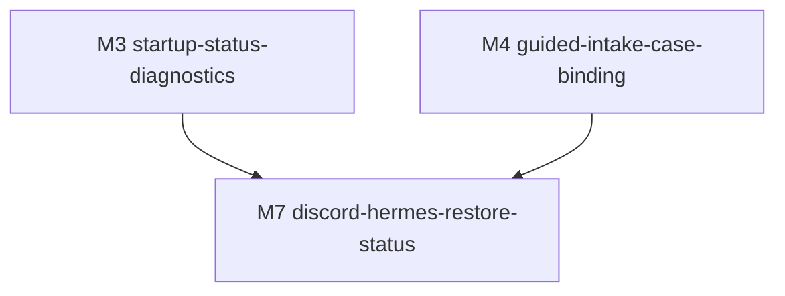

# M7-discord-hermes-restore-status · discord-hermes-restore-status · 模块门面

> **状态**:`Spec complete · Gate 0a/0b PASS`
> **依据**:[../../REQUIREMENTS.md](../../REQUIREMENTS.md), [../../SPLIT.md](../../SPLIT.md), [../M3-startup-status-diagnostics/README.md](../M3-startup-status-diagnostics/README.md), [../M4-guided-intake-case-binding/README.md](../M4-guided-intake-case-binding/README.md)
> **复杂度**:`complex`
> **风险档**:`high`
> **时间盒**:`7-10 days`
> **上游**:`M3-startup-status-diagnostics`, `M4-guided-intake-case-binding`
> **下游**:`none`
> **版本**:v1.1 · 2026-06-29

---

## 一、依据

- [../../REQUIREMENTS.md](../../REQUIREMENTS.md) §6.6 requires restore
  visibility for manifest existence, thread binding, mapping presence, Office
  API reachability, MCP tool reachability, last restore path, and unresolved
  placeholder count.
- [../../SPLIT.md](../../SPLIT.md) places M7 after M3 and M4 because remote
  restore status depends on local readiness and reliable case/thread binding.
- M3 already provides passive readiness/config probes for Office API, MCP, and
  Discord surfaces without sending messages or exposing secrets.
- M4 already provides safe case workflow state names, manifest safe summaries,
  no silent thread overwrite, and outbound Discord/Hermes metadata allowlists.
- Existing code has the private Office API in `legal_redactor/remote_api.py`
  and the Home Mac MCP adapter in `legal_redactor/mcp_adapter.py`.

## 二、目标

Make the Discord/Hermes restore path diagnosable without exposing legal content.
Given a Discord thread id, the user or Hermes should be able to see whether the
Office Mac can resolve the case, whether the map exists, whether the last restore
completed, where the Office-local restored file was saved, how many placeholders
remain unresolved, and what action is needed next.

Completion definition for build:

- Office Mac remains the only authority for manifests, maps, originals, and
  restored output.
- Private API and MCP responses return status, safe case metadata, file name or
  case-relative restored path, counts, and timing metadata only.
- Remote API/MCP/Discord responses do not return restored full text, map values,
  originals, token values, sample contents, `case_root`, `source_dir`, or local
  absolute paths by default.
- Missing manifest, unbound thread, duplicate thread, missing map, unavailable
  Office API, unavailable MCP config/tool list, and unresolved placeholders are
  separate machine-readable states.
- Local Office Web may still offer restore preview/download only where the user
  is operating on the Office Mac/local authority.
- Gate 0a, Gate 0b, and Gate 2 review pass with real `codex + grok` artifacts.

## 三、范围

### 3.1 In Scope

- Add or extend a privacy-safe restore status helper around
  `manifest_safe_summary()`, `find_case_by_discord_thread()`, mapping presence,
  latest restore metadata, and unresolved placeholder counts.
- Harden `legal_redactor/remote_api.py` status and restore responses so remote
  callers receive `restored_filename` / `restored_relative_path` plus counts and
  timing, not absolute Office paths or restored text.
- Update `legal_redactor/mcp_adapter.py` so Hermes tools normalize Office API
  errors without relaying raw HTTP bodies or sensitive text.
- Reuse M3 readiness configuration for Office API/MCP/Discord and M4
  case/thread conflict semantics instead of duplicating startup probes.
- Add local Web restore-status visibility for bound cases, using safe summaries
  and local-only preview/download routes.
- Add tests for API, MCP, case summaries, Web rendering, privacy scrubbing, and
  optional live-smoke fallbacks.
- Update `docs/deploy/hermes-office-restore.md` and README/operator notes with
  the exact status fields and smoke commands.

### 3.2 Out of Scope

- Do not send restored judgments back to Discord automatically. A restored-output
  posting workflow requires a later explicit approval and separate permission
  checks.
- Do not upload maps, originals, sample data, restored full text, or local
  Office paths to Discord, Hermes, webhooks, cloud storage, or review material.
- Do not change recognition rules, prompts, sample-learning logic, model
  defaults, MLX startup, or Word structure-preserving restore semantics.
- Do not require live Discord/Home Mac/Office API credentials for unit tests or
  local implementation; live smoke remains optional and documented.
- Do not silently overwrite a manifest or thread binding during bind/status
  operations.

### 3.3 关键交付物清单

| # | 文件路径 | 类型 | 备注 |
|---|---|---|---|
| 1 | `legal_redactor/cases.py` | 代码 | Safe restore-status summary, last restore metadata, no absolute path leakage |
| 2 | `legal_redactor/remote_api.py` | 代码 | Private status/restore response hardening and timing metadata |
| 3 | `legal_redactor/mcp_adapter.py` | 代码 | MCP tools and safe error normalization |
| 4 | `legal_redactor/web_app.py` | 代码 | Local Office restore-status panel or safe bound-case rendering |
| 5 | `tests/test_remote_api.py` | 测试 | API restore/status/privacy behavior |
| 6 | `tests/test_mcp_adapter.py` | 测试 | MCP tool list, safe errors, config and unreachable paths |
| 7 | `tests/test_cases.py` / `tests/test_web_app.py` | 测试 | Safe summaries and local Web visibility |
| 8 | `docs/deploy/hermes-office-restore.md` / `README.md` | 文档 | Operator runbook and safe response schema |
| 9 | `docs/planning/legal-redactor-workflow-efficiency/milestones/M7-discord-hermes-restore-status/*` | 文档 | Spec/progress/POC/POST_GA evidence |

## 四、决策表

| # | 决策主题 | 取值 | rationale | signoff_version | evidence_link |
|---|---|---|---|---|---|
| D-01 | Office 权威 | Office Mac remains authoritative for case manifest, redaction map, source materials, and restored output. | Requirements and split lock Office Mac as the safe local authority; remote callers must ask Office API instead of carrying maps. | v1.0 | [../../REQUIREMENTS.md](../../REQUIREMENTS.md) §3, §6.6 |
| D-02 | 远程响应最小化 | Remote API/MCP default responses may include status, case folder, Discord thread id/url, mapping presence, restored file name, case-relative restored path, replacement count, unresolved placeholder count, timing, and next action only. | M7 needs visibility without leaking legal text or local host paths. | v1.0 | [../../REQUIREMENTS.md](../../REQUIREMENTS.md) §6.6, [../M4-guided-intake-case-binding/README.md](../M4-guided-intake-case-binding/README.md) D-08 |
| D-03 | 禁止绝对路径泄漏 | Do not return `case_root`, `source_dir`, `/Users/...`, `/Volumes/...`, or other local absolute Office paths through MCP/Discord/API defaults; use file name or case-relative path. | M4 already treats local path leakage as a privacy risk; restore status must inherit that boundary. | v1.0 | `docs/deploy/hermes-office-restore.md`, M4 D-08 |
| D-04 | 状态枚举固定 | Use the full README §4.1 code vocabulary for status success, restore success, API errors, and MCP errors, including `ready`, `missing_manifest`, `unbound_thread`, `duplicate_thread`, `missing_map`, `no_restore_yet`, `restored`, `restore_failed`, `unauthorized`, `missing_server_token`, `invalid_request`, `office_unreachable`, `missing_api_url`, `missing_api_token`, and `office_api_error`. | Operators need one-minute diagnosis and tests need stable assertions. | v1.0 | [../../REQUIREMENTS.md](../../REQUIREMENTS.md) §4 story 8, §6.6 |
| D-05 | 还原元数据本地化 | Store last-restore metadata under the Office case `restored/` area without storing restored text in metadata. | Later status needs last path/count/timing after the restore call; metadata can hold counts without content. | v1.0 | `legal_redactor/cases.py:340-357`, `legal_redactor/remote_api.py:107-129` |
| D-06 | 本地预览限定 | Restored text preview remains local Office Web behavior only; remote API/MCP default responses never include preview text. | Requirements allow local Web preview but prohibit restored full text through MCP/Discord by default. | v1.0 | [../../REQUIREMENTS.md](../../REQUIREMENTS.md) §6.6 |
| D-07 | 绑定冲突失败关闭 | Reuse `case_thread_binding_status()` / manifest conflict semantics; M7 does not silently overwrite different thread bindings. | M4 already signed no silent overwrite as required before restore-by-thread. | v1.0 | [../M4-guided-intake-case-binding/README.md](../M4-guided-intake-case-binding/README.md) D-05 |
| D-08 | Live smoke 可选 | Build tests use synthetic local cases and mocked network paths; live Office/Home/Discord smoke is documented but not required for Gate 2. | Credentials and private network availability are external dependencies. | v1.0 | [../../READINESS.md](../../READINESS.md) §3, §5.3 |
| D-09 | 复用 M3/M4 | Reuse M3 config/readiness and M4 workflow state/safe-summary helpers; do not add a parallel status subsystem. | Avoiding duplicate probes keeps normal workflow simpler and reduces drift. | v1.0 | [../M3-startup-status-diagnostics/README.md](../M3-startup-status-diagnostics/README.md), [../M4-guided-intake-case-binding/README.md](../M4-guided-intake-case-binding/README.md) |
| D-10 | 不碰识别默认 | M7 must not change recognition rules, samples, prompts, or `mlx-community/Qwen3.5-9B-MLX-4bit`. | Restore status hardening is independent of recognition accuracy and runtime benchmarks. | v1.0 | [../../REQUIREMENTS.md](../../REQUIREMENTS.md) §3, §6.5 |

### 4.1 Safe Remote Response Contract

Gate 0a signs this response contract. Build may add helper functions or route
internals, but API/MCP default outputs must preserve these field names and
privacy constraints unless a later Gate explicitly revises the contract.

#### Shared Value Objects

| Object | Field | Type | Nullable | Notes |
|---|---|---|---|---|
| `case` | `case_folder` | string | no | Folder name only, not a path |
| `case` | `discord_thread_id` | string | yes | Empty/null only when no thread is bound |
| `case` | `discord_thread_url` | string | yes | Public Discord URL is allowed when already bound |
| `case` | `workflow_state` | string | no | Existing M4 state vocabulary |
| `case` | `redacted_file_count` | integer | no | Count only |
| `case` | `mapping_present` | boolean | no | Presence only, never map values |
| `restore` | `status` | enum | no | `no_restore_yet`, `restored`, `restore_failed`, `missing_map`, `metadata_unknown` |
| `restore` | `restored_filename` | string | yes | File name only |
| `restore` | `restored_relative_path` | string | yes | Case-relative path such as `restored/name.txt`; never absolute |
| `restore` | `replacement_count` | integer | yes | Count only |
| `restore` | `unresolved_placeholder_count` | integer | yes | Count only; no placeholder list in remote defaults |
| `restore` | `requested_at` | string | yes | ISO-8601 or null |
| `restore` | `completed_at` | string | yes | ISO-8601 or null |
| `restore` | `duration_ms` | integer | yes | Non-negative or null |
| `restore` | `timing_reason` | string | yes | `missing_timestamp`, `metadata_missing`, `metadata_failed`, or null |
| `restore` | `metadata_status` | enum | no | `missing`, `present`, `written`, `failed`, `unknown` |

#### Office API Status Success

`GET /cases/by-discord-thread/{thread_id}` returns HTTP 200 only when the
thread resolves to exactly one Office-local case:

```json
{
  "ok": true,
  "code": "ready",
  "case": {},
  "restore": {},
  "next_action": "restore_ready"
}
```

Allowed `code` values for this success envelope:

- `ready`: manifest and map exist; no blocking restore issue.
- `missing_map`: manifest exists but map is absent.
- `no_restore_yet`: no restore metadata/file exists yet.
- `restored`: latest restore metadata exists.
- `restore_failed`: latest restore metadata records a failed metadata/write step.

#### Office API Restore Success

`POST /cases/by-discord-thread/{thread_id}/restore-text` returns HTTP 200 after
the Office Mac writes restored output locally:

```json
{
  "ok": true,
  "code": "restored",
  "case": {},
  "restore": {
    "status": "restored",
    "restored_filename": "judgment.restored.20260629-000000-000000.txt",
    "restored_relative_path": "restored/judgment.restored.20260629-000000-000000.txt",
    "replacement_count": 3,
    "unresolved_placeholder_count": 0,
    "requested_at": "2026-06-29T00:00:00Z",
    "completed_at": "2026-06-29T00:00:01Z",
    "duration_ms": 1000,
    "timing_reason": null,
    "metadata_status": "written"
  },
  "next_action": "open_office_restored_file"
}
```

The request may contain `draft_text`, but no response field may echo it. Remote
defaults must not return `unresolved_placeholders` arrays. If local Office UI
needs a placeholder list for preview, it must stay in a local-only code path and
be separately named as local-only.

#### Office API Error Envelope

All API errors return a safe envelope through FastAPI `detail`:

```json
{
  "ok": false,
  "error": {
    "code": "missing_manifest",
    "status": 404,
    "message": "safe short message",
    "next_action": "check_thread_binding"
  }
}
```

Allowed API error `code` values and default status:

| code | HTTP | Surface | Meaning |
|---|---:|---|---|
| `missing_manifest` | 404 | status/restore | Case root or manifest not found for the thread |
| `unbound_thread` | 404 | status/restore | Thread id is valid but no manifest binds it |
| `duplicate_thread` | 409 | status/restore | More than one case/root binds the same thread; fail closed |
| `missing_map` | 409 | restore | Manifest exists but mapping file is absent |
| `invalid_request` | 400 | bind/status/restore | Bad thread id, case folder, or forged decision field |
| `unauthorized` | 401 | all API routes | Bearer token mismatch |
| `missing_server_token` | 500 | all protected API routes | Office API token not configured |
| `restore_failed` | 500 | restore | Restore write/metadata write failed without content echo |

#### MCP Direct Result

`mcp_adapter` direct Python helpers return either the Office API success
payload unchanged or:

```json
{
  "ok": false,
  "error": {
    "code": "office_unreachable",
    "status": null,
    "message": "safe short message",
    "next_action": "start_office_api"
  }
}
```

MCP-only error codes are `missing_api_url`, `missing_api_token`,
`office_unreachable`, and `office_api_error`. `office_api_error` may include an
HTTP `status`, but must not include raw HTTP `body`.

#### JSON-RPC Tool Result

JSON-RPC `tools/call` wraps the direct result as JSON text:

```json
{
  "content": [
    {
      "type": "text",
      "text": "{\"ok\":true,\"code\":\"ready\",...}"
    }
  ]
}
```

The stringified `text` must satisfy the same forbidden-field and forbidden-value
rules. JSON-RPC `error` is reserved for adapter exceptions and must also use a
safe message.

#### Forbidden Keys and Value Patterns

Remote API, MCP direct results, JSON-RPC tool results, Discord messages, and
safe Web status must not contain these keys by default:

```text
restored_text, draft_text, original, masked, mapping, redaction_map, map_entries,
case_root, source_dir, api_token, authorization, token, body, traceback,
sample_entries, unresolved_placeholders
```

They must also reject or scrub values containing Office absolute paths
(`/Users/`, `/Volumes/`), bearer-token strings, raw map values, original legal
text, restored legal text, or sample bodies. Tests should inject synthetic
canaries for each category.

## 五、七层硬门槛 / 选型

M7 is complex because it spans private HTTP API, MCP adapter behavior, local Web
status, file-system case metadata, cross-machine operator docs, and privacy
controls around restored legal text. Risk is high because the workflow touches
restored judgments, bearer-token-protected API calls, and cross-machine
responses. The project profile is `standard`; this spec upshifts the effective
profile to `strict` for M7.

七层条数预估:

| 层 | 预估条数 | 备注 |
|---|---:|---|
| D | 10 | Office authority, safe remote schema, path/privacy, state/error vocabulary, timing |
| P | 6 | Pure status summary, path scrubber, metadata writer/reader, timing, error normalizer |
| S | 5 | API restore/status behavior, no overwrite, bounded metadata writes, safe errors |
| N | 3 | MCP tool results, unreachable Office path, no Discord restored-output posting |
| C+A | 4 | Private HTTP routes, MCP JSON-RPC, local Web status, operator commands |
| T | 7 | Unit/integration/privacy tests, mocked network, focused suite, optional live smoke doc |
| E | 5 | README/deploy docs, progress closeout, POST_GA, sensitive audit, handoff |

## 六、依赖图



## 七、上下游依赖

### 7.1 上游

- M3 supplies passive Office API/MCP/Discord readiness config semantics and
  secret-safe status rules.
- M4 supplies case workflow states, safe manifest summaries, conflict detection,
  local path scrub rules, and redacted-only Discord boundary.
- Existing Office API and MCP adapter supply the route/tool names that M7 should
  harden rather than replace.

### 7.2 下游

- No planned milestone is blocked by M7.
- M6 regression report can later consume M7's `discord_thread_to_restored_ms`
  and restore metadata if those fields are available.
- Any future restored-output Discord posting must treat M7 safe status schema as
  input and request separate user approval.

## 八、风险 + 缓解

| 风险 | 影响 | 缓解 |
|---|---|---|
| Restored text leaks through API/MCP/Discord | Severe privacy breach | D-02/D-03/D-06 plus tests that inject canary text and assert it never appears in remote JSON |
| Absolute Office path leaks to Home Mac or Discord | Reveals local filesystem/case organization | Return file name and case-relative path only; test `/Users/`, `/Volumes/`, `case_root`, `source_dir` absence |
| Missing map or manifest collapses into generic error | Operator cannot diagnose restore failure | Stable status/error codes and next action strings |
| Binding conflict restores with wrong map | Wrong judgment restoration | Reuse M4 fail-closed binding conflict helpers |
| Live credentials unavailable | Gate blocked by external state | Mocked tests are Gate proof; live smoke is HUMAN_TASKS optional |
| Restore metadata sidecar stores content | Creates another sensitive artifact | Metadata schema contains counts/timestamps/file names only and is covered by sensitive audit |
| MCP relays raw HTTP body | May leak internal details or sensitive payloads | Parse structured JSON errors and return safe code/status/message only |

## 九、时间盒

| Step | 估时 | 备注 |
|---|---:|---|
| Step 0 · POC + 防护栏 | 1 day | Current API/MCP gaps, safe response schema, path scrub, timing metadata, local preview boundary |
| Step 1 · restore status data contract | 2 days | Case safe summary, last restore metadata, state/error vocabulary |
| Step 2 · Office API hardening | 2 days | Status and restore responses, safe errors, no absolute path/default text leakage |
| Step 3 · MCP + Web integration | 2 days | Tool result normalization, local Web status, mocked unreachable paths |
| Step 4 · docs + validation + Gate 2 | 2-3 days | Focused/full tests, privacy audit, runbook, review proof |
| **总计** | **7-10 days** | Complex/high-risk effective strict profile |

**断路触发**: same privacy leak appears after three repair attempts, a live
credential becomes mandatory to test non-live code paths, path scrubbing cannot
preserve useful Office-local status, or restore metadata cannot avoid storing
restored text.

## 十、本 milestone 文档清单

| 件 | 文件 | 说明 |
|---|---|---|
| 1 · README | [本文件](README.md) | Milestone door and decisions |
| 2 · EXECUTION_PLAN | [EXECUTION_PLAN.md](EXECUTION_PLAN.md) | Hard gates and build order |
| 3 · HUMAN_TASKS | [HUMAN_TASKS.md](HUMAN_TASKS.md) | Optional live credentials and review signoff |
| 4 · step-0-poc-report | [step-0-poc-report.md](step-0-poc-report.md) | POC E-1 through E-5 |
| 5 · _progress | [_progress.md](_progress.md) | Gate/progress/grep trace |
| 6 · POST_GA | [POST_GA_OBSERVATION.md](POST_GA_OBSERVATION.md) | High-risk observation plan |
